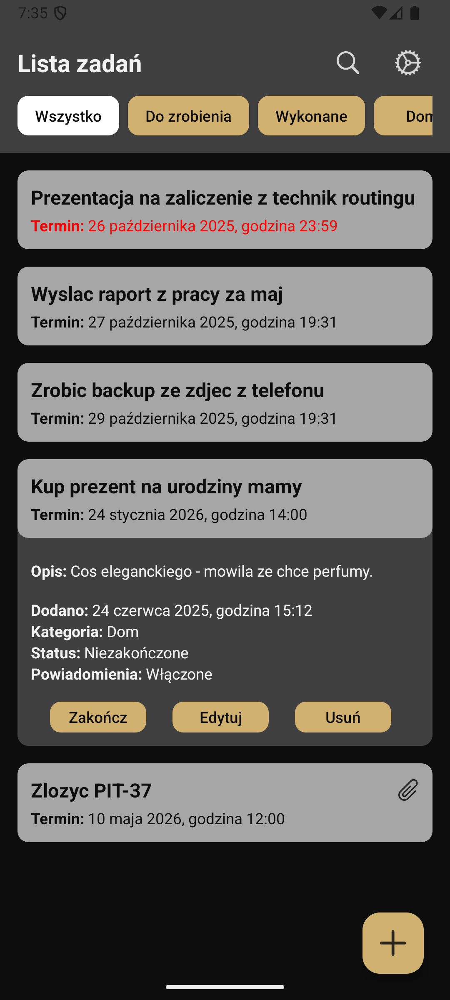

# Advanced Android To-Do List

A native Android To-Do app (Java) featuring task notifications and file attachment capabilities.

## About This Project

This is a native Android application built with Java, designed to be a comprehensive tool for daily task management. The project's core focus is on demonstrating the integration of core Android system services and robust data management.

Unlike a basic to-do list, this app includes features for task scheduling (via notifications) and the ability to link external media (attachments) to specific tasks, creating a more powerful user experience.

## Key Features

* **Task Scheduling & Notifications:** Utilizes the Android `NotificationManager` to provide users with timely, scheduled reminders for upcoming tasks.
* **File Attachments:** Functionality allowing users to attach files to specific tasks, demonstrating skills in handling file storage and system permissions.
* **Data Persistence:** Efficient local database storage for all tasks, notes, and attachment metadata.
* **CRUD Functionality:** Full Create, Read, Update, and Delete capabilities for all tasks.

## Technologies Used

* **Language:** Java
* **Platform:** Android SDK
* **Notifications:** Android NotificationManager
* **Database:** Room Persistence Library
* **File Handling:** ContentResolver and Internal Storage

## Screenshots

| Task List View | Add/Edit Task View | Sorting on homescreen |
| :---: | :---: | :---: |
|  |  |  |

## Setup

1.  **Clone the repository:**
    ```bash
    git clone [https://github.com/ekl3m/android-todo-app.git](https://github.com/ekl3m/android-todo-app.git)
    ```
2.  **Open in Android Studio:**
    Open the project directory in Android Studio.
3.  **Build & Run:**
    Build and run the application on an Android device or emulator. No API keys are required.

## License

This project is licensed under the GNU General Public License v3.0 - see the [LICENSE](LICENSE) file for details.
